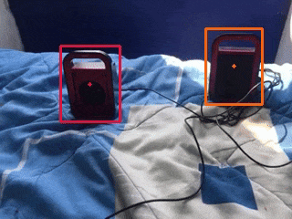

# Do visual cues help vllms ? 

TLDR : Not really. 

## Problem
VLMs are very good at identifying events in videos. But it is hard to focus their attention on a specific action or object, specially if the object or action is a small part of the video. Humans use visual cues to attract attention towards a region or action, e.g. a stop sign on the road or a wiggly line drawn under wrongly spelled text. Once focused we can observe finegrained details from that region. We experiment if using similar visual cues helps VLMs focus better.

 

## Experiment
### Data
We use a 10k video subset of ssv2 dataset 

### Cues

### Model

### Results
| model                      | videos      | object_acc | verb_acc | overall_acc |
|---------------------------|-------------|-----------:|---------:|------------:|
| finetuned                  | plain       | 96.40%     | 98.30%   | 97.29%      |
| finetuned                  | trajectory  | 93.77%     | 98.00%   | 95.65%      |
| pretrained | plain       | 90.77%     | 63.90%   | 79.39%      |
| pretrained | trajectory  | 85.74%     | 64.40%   | 76.29%      |

## Reproduce on own

Clone repo

Clone data
`https://huggingface.co/datasets/apurvagup/visual_cues_ssv2/`

### Run training 

