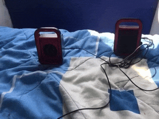

# Do visual cues help vllms ? 

## Problem
VLMs are very good at identifying events in videos. But it is hard to focus their attention on a specific action or object, specially if the object or action is a small part of the video. Humans use visual cues to attract attention towards a region or action, e.g. a stop sign on the road or a wiggly line drawn under wrongly spelled text. Once focused we can observe finegrained details from that region. This experiment is to determine if using visual cues like bboxes/trajectories will help VLMs focus better.

TLDR : Not really.

 

## Experiment
### Training
A ~9.5k video subset of ssv2 dataset which has 50 verbs and ~4000 objects. 

```python
>> random.sample(verbs, 5)
>> ['picking', 'dropping', 'throwing', 'poking', 'twisting']

>> random.sample(objects, 5)
>> ['a teaspoon', 'amrutanjan balm', 'teapoy', 'a pamphlet', 'salt container']
```

Create multiple choice questions for every video, to predict the object or verb 
|Video plain / cued| mcq |
|---|---|
|   | **Q1.** dropping _____ into red rubber ice-tray.  <br>**Options:** crumpled paper \| a gift bag \| thermos bottle \| **a cheese cube**  <br>**Answer:** a cheese cube  <br><br> **Q2.** dropping a cheese cube into _____.  <br>**Options:** dettol bottle \| salt shaker \| stack plastic cups \| **red rubber ice-tray**  <br>**Answer:** red rubber ice-tray  <br><br> **Q3.** _____ a cheese cube into red rubber ice-tray.  <br>**Options:** hitting \| pulling \| falling \| **dropping**  <br>**Answer:** dropping |

#### Training sample
```json
{
   "question": "_____ plastic spoon down",
   "choices": [
    "moving",
    "tipping",
    "lifting",
    "folding"
   ],
   "answer": "moving",
   "video": "104789",
   "type": "verb"
  }
```

#### Setup
- We split the dataset into test:train::1000:8500 
- Each video has average of 2.5 questions
- This results in ~42k training samples
- We train a single model with both plain and cued videos for 1 epoch
    - base = qwenvl3 2b/4b instruct
    - lora `(rank=64, alpha=64)` over llm only
    - cosine lr with peak 1e-4, and warmup of 3%
- vllm for inference with guided response choices 

### Results
Before finetuning, object accuracy is lower for cued videos. 
| model                      | videos      | object_acc | verb_acc | overall_acc |
|---------------------------|-------------|-----------:|---------:|------------:|
| pretrained | plain       | 90.77%     | 63.90%   | 79.39%      |
| pretrained | trajectory  | 85.74%     | 64.40%   | 76.29%      |


After finetuning, cued videos perform worse in both object and verb category. 
| model                      | videos      | object_acc | verb_acc | overall_acc |
|---------------------------|-------------|-----------:|---------:|------------:|
| finetuned                  | plain       | 96.40%     | 98.30%   | 97.29%      |
| finetuned                  | trajectory  | 93.77%     | 98.00%   | 95.65%      |


## Interpretation
### Attention maps
What happens to attention when we add these boxes and trajectory lines ? Intuitively, results should be much better because there is a clear indicator of region which will fetch correct answer. But something else happens.  

## Reproduce

#### Clone repo
```sh
git clone https://github.com/4g/visual_cues.git
cd visual_cues
```


#### Clone data and adapters

```sh
python prepare_data.py

hf download --repo_type dataset --repo_id apurvagup/visual_cues_ssv2/ --local_dir ./data/
```
This will download training and test videos, and pretrained lora adapter into `data/`

#### Run measurements
```
python measure.py
```
- Brings up a vllm server with both finetuned and pretrained model and measures results

### Training

```sh
sh scripts/lora_2b.sh
```


